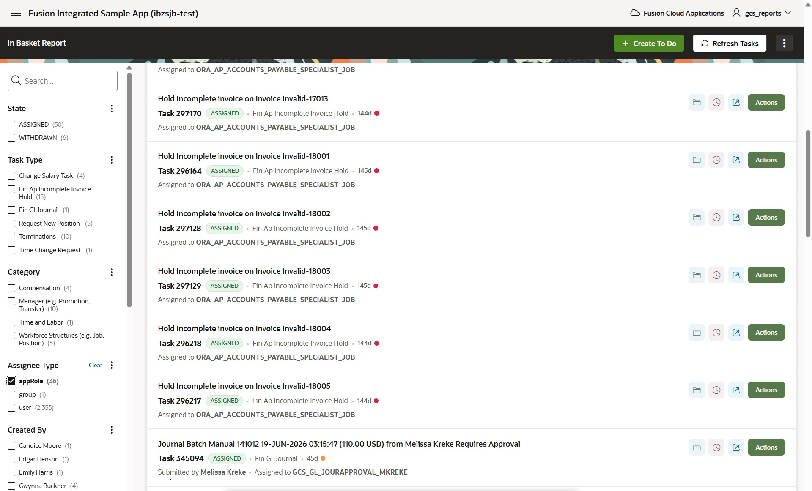

# BPM Workflow Tasks

Oracle APEX application for managing Fusion BPM approval tasks. Tasks are loaded via BIP (BI Publisher) SOAP report and acted on via BPM REST API. Provides a faceted search dashboard with inline detail panels for comments, attachments, notification content, and approval history -- plus the ability to take actions (approve, reject, reassign, etc.) directly from APEX.



## Architecture

### Task Loading (BIP)

Tasks are loaded into `bpm_workflow_tasks` by `pkg_bip_soap.load_bpm_tasks`, which calls the BIP report `bpm_task_list_xml.xdo`. This report queries `fa_fusion_soainfra.wftask` and LEFT JOINs a `task_payload` CTE that extracts `ObjectId` (assignment_id) from the `TransactionApprovalRequest` XML payload in `WFMESSAGEATTRIBUTE`, then resolves person data through the HCM effective-dated join chain:

```
WFMESSAGEATTRIBUTE (TransactionApprovalRequest XML)
  → ObjectId = ASSIGNMENT_ID
    → PER_ALL_ASSIGNMENTS_M.PERSON_ID
      → PER_ALL_PEOPLE_F.PERSON_NUMBER
```

This populates `ASSIGNMENT_ID`, `PERSON_ID`, and `PERSON_NUMBER` on tasks that have a transaction payload. Validated for: ResignationApproval, TransfersApproval, PromotionsApproval, ChangeSalaryApprovalTask, ChangeAssignmentApproval, AddNewAssignmentApprovalTask, and TerminationsApproval. Task types without a payload (including todo tasks) get NULLs -- the LEFT JOINs ensure they still appear.

**Important**: The BIP SQL uses `NVL(w.taskdefinitionname, 'X') NOT IN (...)` to handle todo tasks, which have NULL `taskdefinitionname`. A bare `NOT IN` silently drops NULLs.

Supports incremental loading (`p_updated_since` parameter) or full refresh (`NULL`).

### Task Actions (REST)

Task actions (approve, reject, reassign, etc.) are handled by `pkg_bpm_tasks.action_task` via the BPM REST API. All other REST calls in `pkg_bpm_tasks` are for on-demand detail retrieval (comments, attachments, history, notification content).

### APEX Dashboard

The faceted search dashboard (page 6204) LEFT JOINs `bpm_workflow_tasks` to `hcm_employee_bc` for location-based filtering. The JOIN uses COALESCE with a regex fallback for tasks without BIP-sourced person data:

```sql
LEFT JOIN hcm_employee_bc e
       ON e.person_number = COALESCE(
              t.person_number,
              REGEXP_SUBSTR(t.title, ',\s*(\d+)\s*\(', 1, 1, NULL, 1)
          )
```

The regex fallback only applies at query time -- it never writes to the table, avoiding the person_id corruption issue where person numbers (5-6 digits) were stored in the person_id column (which expects 15-digit Fusion internal IDs).

## Features

- **Faceted Search Dashboard** -- Page 6204 with facets for state, assignee, location, category, task type, aging bucket, and effective month
- **Inline Detail Panel** -- Expand/collapse panel per task row showing comments and attachments
- **Notification Content** -- Rendered BIP HTML from the HCM `businessProcessNotifications` endpoint, displayed inline via sandboxed iframe. The Fusion-only `ORA_REDWOOD_HISTORY_REGION_BIP_TOKEN` placeholder is hidden and replaced with native approval history rendered below the iframe
- **Add Comments** -- Post comments to tasks directly from the panel (Ctrl+Enter to submit)
- **Upload Attachments** -- Upload files via multipart/mixed POST with client-side 10 MB guard
- **Download Attachments** -- Download attachment files via streaming proxy (base64 decode in browser)
- **Approval History** -- Separate toggle column showing the full approval chain with action, approver, state, and timestamps; future participants are visually dimmed
- **Task Actions** -- Approve, reject, reassign, acquire, delegate, push back, escalate, suspend, resume, skip current assignment, or request information with optional comments
- **Request Information** -- Sends INFO_REQUEST to the task submitter (or any Fusion user), moving the task to `INFO_REQUESTED` state. Assignee field auto-populates with the original submitter's user ID
- **Fusion Deeplink** -- "View in Fusion" icon link opens the native Fusion notification form in a new tab
- **Create Todo Tasks** -- Drawer form (page 6104) to create standalone todo tasks in assignees' BPM inboxes
- **Person Mapping** -- BIP join chain resolves worker identity (assignment_id, person_id, person_number) for HCM transaction tasks, enabling location-based filtering on the dashboard
- **Action Audit Trail** -- `last_action`, `last_action_by`, `last_action_ts`, `last_action_status`, `last_action_response` columns track who did what and when

## Files

| File | Description |
|---|---|
| `bpm_workflow_tasks.sql` | Table DDL -- task metadata + person mapping + action audit trail |
| `bpm_workflow_task_assignees.sql` | Assignees child table DDL |
| `alter_bpm_workflow_tasks.sql` | ALTER to add assignment_id and person_number columns |
| `pkg_bpm_tasks.sql` | Package spec -- action and detail retrieval procedures |
| `pkg_bpm_tasks.plb` | Package body |
| `bpm_task_detail_js.js` | JavaScript -- toggle panels, fetch/render comments, attachments, history, notification content; upload/download handlers; facet helpers |
| `bpm_task_detail_css.css` | Styles -- amber for payload details, blue for comments, teal for attachments, redwood for history |
| `bpm_task_detail_apex.sql` | APEX setup instructions + Ajax callback PL/SQL for pages 6003 and 6204 |
| `chart_setup.sql` | Chart region SQL for dashboard metrics |
| `get_task_charts.sql` | Task chart queries |
| `fix_corrupted_person_ids.sql` | Diagnostic/repair script for rows where person_number was stored in person_id |
| `test_resignation_join_chain.sql` | Test script -- validates BIP join chain returns person data |
| `test_truncate_reload.sql` | Test script -- truncate + full reload |
| `f147.sql` | Standalone APEX application export |
| `f147_page_6003.sql` | Page 6003 (Task Actions modal) export |
| `f147_page_6204.sql` | Page 6204 (Task Dashboard) export |

## API Endpoints Used

| Method | Endpoint | Version | Credential | Purpose |
|---|---|---|---|---|
| GET | `/bpm/api/4.0/tasks/{number}` | 4.0 | `gc_user_credential` | Single task detail with `actionList` |
| GET | `/bpm/api/4.0/tasks/{number}/comments` | 4.0 | `gc_credential` | Fetch comments |
| GET | `/bpm/api/4.0/tasks/{number}/attachments` | 4.0 | `gc_credential` | Fetch attachment metadata |
| GET | `/bpm/api/4.0/tasks/{number}/attachments/{name}/stream` | 4.0 | `gc_credential` | Download attachment bytes |
| GET | `/bpm/api/4.0/tasks/{number}/history` | 4.0 | `gc_credential` | Approval history chain |
| POST | `/bpm/api/3.0/tasks/{number}/comments` | 3.0 | `gc_credential` | Add comment |
| POST | `/bpm/api/3.0/tasks/{number}/attachments` | 3.0 | `gc_credential` | Upload attachment (multipart/mixed) |
| POST | `/bpm/api/3.0/tasks/todoTask` | 3.0 | `gc_credential` | Create standalone todo task |
| PUT | `/bpm/api/4.0/tasks/{number}` | 4.0 | `gc_user_credential` | ACQUIRE, SKIP_CURRENT_ASSIGNMENT, INFO_REQUEST, INFO_SUBMIT |
| PUT | `/bpm/api/3.0/tasks` | 3.0 | `gc_user_credential` | All other actions (APPROVE, REJECT, REASSIGN, ESCALATE, SUSPEND, RESUME, etc.) |
| GET | `.../businessProcessNotifications/{taskId}/enclosure/content` | HCM | `gc_credential` | Rendered BIP notification HTML |
| POST | `.../businessProcessNotifications/action/getDeeplinkUrlForEditAction` | HCM | `gc_user_credential` | Redwood transaction deeplink URL |

Task loading uses BIP SOAP (`pkg_bip_soap.run_report_xml`), not the BPM REST task list endpoint.

## Package: pkg_bpm_tasks

This package handles task actions and on-demand detail retrieval. It does **not** load tasks -- that is handled by `pkg_bip_soap.load_bpm_tasks`.

### Constants

| Constant | Value | Purpose |
|---|---|---|
| `gc_credential` | `gcs_reports` | Admin service account -- read-only GETs |
| `gc_user_credential` | `APEX_FA_IBZSJB_DEV2_DBMS_CRED` | Logged-in user's Fusion token -- actions and user-specific reads |
| `gc_base_url` | `https://ibzsjb-dev2.fa.ocs.oraclecloud.com` | Fusion instance base URL |

### `action_task(p_task_number, p_action, p_comment, p_assignee_id, p_assignee_type, p_credential_id)`
Routes to the correct endpoint based on action type:
- **4.0 single-task** (`PUT /tasks/{number}`): ACQUIRE, SKIP_CURRENT_ASSIGNMENT, INFO_REQUEST, INFO_SUBMIT
- **3.0 bulk** (`PUT /tasks`): all other actions

Logs results to `last_action_*` columns including `last_action_by` (the APEX user who took the action).

### `get_task_actions(p_task_number) RETURN CLOB`
Returns raw task JSON including the user-specific `actionList`. Uses `gc_user_credential`.

### `get_comments(p_task_number) RETURN CLOB`
Returns raw JSON from the 4.0 comments endpoint.

### `add_comment(p_task_number, p_comment)`
Posts a comment via the 3.0 API.

### `get_attachments(p_task_number) RETURN CLOB`
Returns raw JSON from the 4.0 attachments endpoint.

### `add_attachment(p_task_number, p_file_name, p_content_type, p_file_b64)`
Decodes base64 CLOB to BLOB, builds multipart/mixed body, POSTs via 3.0 API.

### `get_history(p_task_number) RETURN CLOB`
Returns raw JSON from the 4.0 history endpoint.

### `get_notification_content(p_task_id) RETURN CLOB`
Returns the fully rendered BIP notification HTML for a task using the task's GUID. Works for all task types.

### `get_deeplink_url(p_task_id) RETURN VARCHAR2`
Returns the Redwood deep link URL for editing the transaction behind a task. Returns NULL if the task is not editable. Must use `gc_user_credential` -- service accounts always get `EDIT: false`.

### `create_todo_task(p_title, p_assignee_id, p_priority, p_start_date, p_due_date)`
Creates a standalone todo task in the assignee's BPM inbox via the 3.0 API.

## Task Loading: pkg_bip_soap.load_bpm_tasks

Located in the parent project's `pkg_bip_soap` package (not in this repo). Key details:

- **BIP report**: `bpm_task_list_xml.xdo` in `/Custom/SCI/BIP/`
- **Parameter**: `p_updated_since` (NULL = full refresh, non-NULL = incremental with `p_updated_ts` date bind)
- **MERGE**: Deduplicates on `task_number` via ROW_NUMBER, preserves local action/tracking columns via COALESCE on UPDATE
- **Person columns**: `assignment_id`, `person_id`, `person_number` -- sourced exclusively from BIP join chain, no regex fallback in the loader
- **Zero rows**: Valid for incremental loads (no error raised)
- **Logging**: Uses `bip_load_log` table with report_key `'BPM_TASKS'`

## APEX Setup

See `bpm_task_detail_apex.sql` for step-by-step instructions:

1. Compile `pkg_bpm_tasks.sql` (spec) then `pkg_bpm_tasks.plb` (body)
2. Upload `bpm_task_detail_js.js` and `bpm_task_detail_css.css` to Static Application Files
3. Reference on page 6204 as `#APP_FILES#bpm_task_detail_js#MIN#.js` / `#APP_FILES#bpm_task_detail_css#MIN#.css`
4. Report SQL LEFT JOINs to `hcm_employee_bc` with COALESCE person_number fallback
5. Add toggle columns (Escape Special Characters = No): `DETAIL_TOGGLE`, `HISTORY_TOGGLE`, `NOTIF_TOGGLE`, `FUSION_LINK`
6. Add `TO_CHAR(task_number) AS task_number_vc` as a hidden column for Row Search (APEX Row Search does not match NUMBER columns via LIKE)
7. Create Ajax Callback processes on page 6204: `GET_NOTIFICATION_CONTENT`, `GET_EDIT_DEEPLINK`, `GET_TASK_COMMENTS`, `GET_TASK_ATTACHMENTS`, `ADD_TASK_COMMENT`, `ADD_TASK_ATTACHMENT`, `DOWNLOAD_TASK_ATTACHMENT`, `GET_TASK_HISTORY`, `GET_FUSION_DEEPLINK`
8. Create modal page 6003 (Task Actions) with Ajax callbacks: `GET_TASK_ACTIONS`, `ACTION_TASK`
9. Create drawer page 6104 (New Todo) with `CREATE_TODO_TASK` process

## Credential Strategy

Two APEX Web Credentials are defined as package-level constants:

| Constant | Default | Role |
|---|---|---|
| `gc_credential` | `gcs_reports` | Admin service account -- all read-only GETs |
| `gc_user_credential` | `APEX_FA_IBZSJB_DEV2_DBMS_CRED` | Logged-in user's Fusion token -- actions and user-specific reads |

**Read-only operations** (comments, attachments, history, notification content) use `gc_credential`. The admin account can see all tasks regardless of assignee.

**User-identity operations** must use `gc_user_credential`:
- **`GET_TASK_ACTIONS`** -- the `actionList` is user-specific
- **`action_task`** -- BPM records the authenticated caller as the approver in its audit trail
- **`get_deeplink_url`** -- checks whether the *calling user* has edit rights

APEX's Fusion Auth integration stores the logged-in user's token as a Web Credential with a fixed static ID, resolved per-session at runtime.

## v3.0 vs v4.0 Notes

- **GETs use 4.0** -- richer JSON shape, supports `history` and `payload` sub-resources
- **POSTs/PUTs use 3.0** -- the v4.0 PUT endpoint returns error 76012 on most write operations
- **Exceptions requiring 4.0 PUT** (`/tasks/{number}`): ACQUIRE, SKIP_CURRENT_ASSIGNMENT, INFO_REQUEST, INFO_SUBMIT
- **BPM API quirks**: `updatedDate` in comments JSON is misspelled as `updateddDate` (double "d")

## Known Issues

### Fusion deep link unavailable for API-claimed tasks

Tasks claimed through the BPM REST API (e.g., ACQUIRE from APEX) do not receive the Fusion worklist context required for deep-link generation. `getDeeplinkUrlForEditAction` returns no URL. Tasks arriving through normal Fusion workflow (the vast majority) have working deep links.

### REASSIGN action via REST API

As of August 2026, the REASSIGN action does not work reliably:
- **3.0 bulk endpoint**: Returns `{}` and silently ignores the reassignment (comments *are* posted, making it appear successful)
- **4.0 single-task endpoint**: Returns error 76012 regardless of user ID format

Code routes REASSIGN through the 3.0 ELSE branch which silently no-ops.
